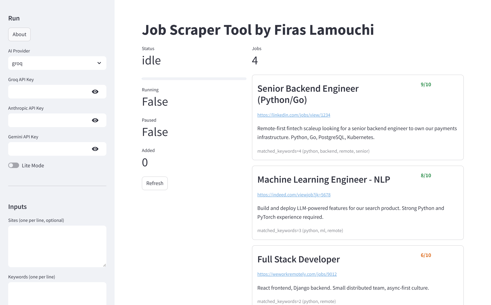
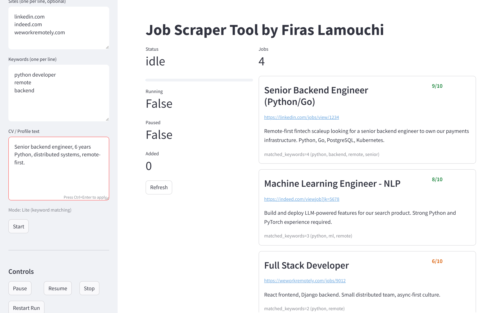

# Job Scraper Tool


Self-hosted job search that scores every listing against your CV — AI optional. Paste your CV and a few keywords, hit Start, and it searches multiple job sites and ranks results 0-10 by how well they actually match you, instead of you skimming ten tabs every morning.

Built it for myself while job hunting. It found the job. Now I'm making it good enough for other people to use too.



## Why this one

- **AI scoring is optional, not required.** Bring a Groq, Anthropic, or Gemini key for AI-scored relevance, or run entirely free in Lite Mode (keyword matching, no key, no signup).
- **Your data stays yours.** Everything lands in a local SQLite file you own — nothing is sent anywhere unless you explicitly configure an AI key or a notification webhook.
- **One command to run the whole thing.** `docker compose up --build` and you have a dashboard, a REST API, and a database. No local Python setup, no dependency hell.
- **Built to be scriptable.** Everything the UI does is also a REST endpoint (see [API for power users](#api-for-power-users)) and a CLI command, so you can wire it into your own automation.

## What you get

- Paste your CV and keywords into the web UI
- AI scores every job 0-10 for relevance (or Lite Mode keyword matching, no key needed)
- Pause, resume, or restart runs from the dashboard
- Export results as JSON or CSV
- Optional webhook/email alerts when a high-scoring job shows up
- All data lives in a SQLite database you actually own



## How to run it

You need Docker. That's it.

### 1. Set your environment

```bash
cp .env.example .env
```

Edit `.env` and drop in any AI keys you have (Groq, Anthropic, or Gemini). If you don't have any, Lite Mode works fine with keyword matching.

### 2. Spin it up

```bash
docker compose up --build
```

This builds two containers:

- **scraper** at `http://localhost:8000` (the brain)
- **UI** at `http://localhost:8501` (your dashboard)

The optional n8n automation engine lives under a separate profile if you want it later:

```bash
docker compose --profile automation up
```

### 3. Open the UI

Go to `http://localhost:8501`, paste your CV, add some keywords like "senior python remote", pick your AI provider (or stay in Lite Mode), and hit Start. Watch the progress bar fill up. High-scoring jobs bubble to the top.

### 4. Export when done

```bash
curl http://localhost:8000/export/csv > jobs.csv
```

## Docker is the only way

This app is designed to run inside Docker containers on a Linux VM. Do not try to run it natively on Windows or macOS. The scraper uses Playwright, the UI needs Streamlit, and the database expects a Unix path structure. Docker handles all of that for you.

Requirements:

- Docker Engine 24+ or Docker Desktop
- A Linux VM (WSL2 on Windows, OrbStack or Docker Desktop on Mac, any Linux host)
- 2GB RAM minimum, 4GB recommended

## Environment variables

| Variable | What it does | Default |
| --- | --- | --- |
| `GROQ_API_KEY` | Groq AI scoring | empty |
| `ANTHROPIC_API_KEY` | Claude AI scoring | empty |
| `GEMINI_API_KEY` | Google AI scoring | empty |
| `DATA_DIR` | Where SQLite and logs live | `./data` |
| `REQUEST_DELAY_SECONDS` | Politeness between searches | `2.0` |
| `RETRY_MAX_ATTEMPTS` | How many times to retry a failed search | `5` |
| `MIN_SCORE_NOTIFY` | Minimum score (0-10) to trigger a notification | `7` |
| `NOTIFICATION_WEBHOOK` | Webhook URL for high-score job alerts | empty |
| `EMAIL_HOST` / `EMAIL_PORT` / `EMAIL_USER` / `EMAIL_PASS` / `EMAIL_TO` | SMTP settings for email alerts | empty |

## API for power users

The scraper exposes a FastAPI server. The UI talks to it, but you can too.

Start a run:

```bash
curl -X POST http://localhost:8000/run \
  -H "Content-Type: application/json" \
  -d '{"provider":"groq","lite_mode":true,"sites":["example.com"],"keywords":["python"],"cv_text":"developer"}'
```

Check status:

```bash
curl http://localhost:8000/status
```

Pause a running job:

```bash
curl -X POST http://localhost:8000/pause
```

Resume:

```bash
curl -X POST http://localhost:8000/resume
```

Kill it:

```bash
curl -X POST http://localhost:8000/stop
```

## Makefile shortcuts

```bash
make build
make up
make down
make logs
```

## Keeping your keys safe

Never commit `.env`. It is gitignored by default. If you accidentally pushed a key, rotate it immediately.

## Contributing

Issues and PRs are welcome — see [CONTRIBUTING.md](CONTRIBUTING.md). If you're using this and hit something, opening an issue is the single most useful thing you can do; this is a solo project so far and every report helps.

If you find it useful, a star helps other people find it too.
